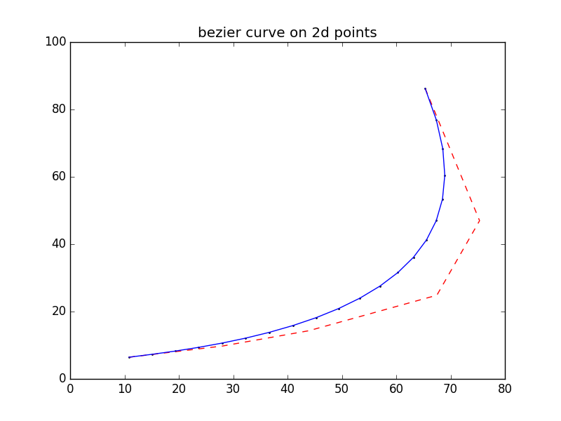
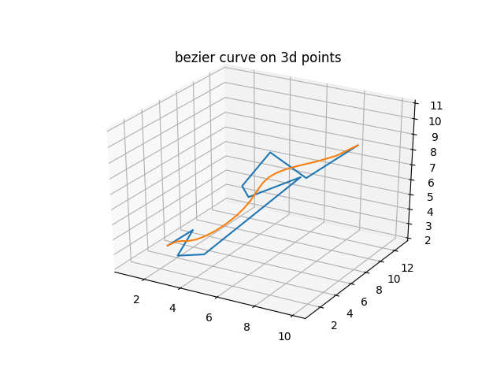

[](https://travis-ci.org/xmba15/bezier_curve/builds)
[](https://opensource.org/licenses/MIT)

# Generic Bezier Curve Library #
- Generic Bezier Curve Library that supports control points of arbitary dimension numbers. (2D and 3D for normal, curvature calculations).
- Class of control point Container is built on top of Eigen Matrix; but can possibly be replaced with user-defined Point Container Class (which is quite a tedious task if starting from 0).

## Dependencies ##
- [Eigen](http://eigen.tuxfamily.org)(**Current build with cmake was tested on Ubuntu 18.04. Build on lower version of Ubuntu OS might require modification of CMake to find Eigen OR manually build latest Eigen from source.**)

## How to Build ##
```bash
cd /path/to/bezier_curve
mkdir build && cd build
cmake ../ && cmake --build .
```

### Build Options ###
 - WITH_DEBUG=ON/OFF(default: OFF) : whether to enable debug
 - BUILD_EXAMPLES=ON/OFF(default: OFF) : whether to enable build examples

## General Usage ##
```cpp
\\ To be added
```

## Examples ##
### 2d points ##

Example for 5-degree bezier curve of the following 2d control points:

```bash
Original control points:
10.83,6.44
27.99,9.75
43.91,14.3
67.48,24.84
75.34,46.97
65.33,86.25
```



### 3d points ##

Example for 9-degree bezier curve of the following 3d control points:

```bash
Original control points:
1,5,2
2,6,3
3,2,3
4,3,3
5,13,5
6,4,7
7,1,9
8,2,11
9,4,9
10,8,10
```



## Acknowledgement ##
- This library is inspired by the following [Bezier library](https://github.com/oysteinmyrmo/bezier), which supports only 2D space (as of 21st June, 2019)
